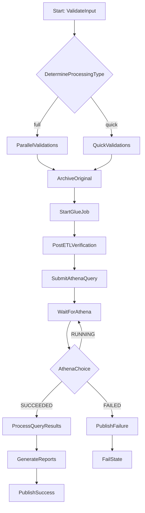

# Enterprise Data Quality and Analytics Pipeline Using AWS Step Functions

## Overview

This repository contains a reference implementation and documentation for an enterprise-grade data ingestion, validation, transformation, and reporting pipeline orchestrated by AWS Step Functions. It models a retail scenario where transactional CSV files are uploaded to S3 by hundreds of stores throughout the day.

The workflow is designed to show how Step Functions can orchestrate multiple AWS services in a reliable and maintainable manner while also demonstrating common state machine patterns such as branching, parallel execution, asynchronous polling, retries, catches, and map processing.

## What is included

- A Step Functions state machine definition: [state_machine/state_machine.asl.json](state_machine/state_machine.asl.json)
- Lambda function stubs and helpers: [lambdas/](lambdas/)
- A sample AWS Glue PySpark ETL job: [glue/glue_job.py](glue/glue_job.py)
- [BusinessRequirement.txt](BusinessRequirement.txt) with the business requirements that motivate the workflow
- [requirements.txt](requirements.txt) listing Python dependencies for local packaging

## Business flow summary

The pipeline follows a practical enterprise pattern:

1. Receive an uploaded file from S3.
2. Validate the file and its metadata.
3. Run quality checks in parallel.
4. Archive the original file for auditability.
5. Trigger an ETL job in Glue.
6. Wait for the ETL job to complete.
7. Submit and monitor an Athena query.
8. Process query results in parallel.
9. Generate reports in multiple formats.
10. Publish success or failure notifications.

## Step Functions implementation walkthrough

### 1. Entry and validation

The workflow starts at ValidateInput. This state invokes a Lambda function that performs basic input validation such as:

- file existence
- expected naming convention
- correct file extension
- required metadata checks

If validation fails, the workflow uses Catch to route execution to PublishFailure and then FailState.

### 2. Branching based on processing type

The DetermineProcessingType state uses Choice to decide whether the workflow will take a full validation path or a lighter quick-validation path. This demonstrates how Step Functions can branch based on runtime input.

### 3. Parallel validations

The ParallelValidations state demonstrates Parallel execution. Independent quality checks run at the same time:

- virus scan
- schema validation
- duplicate detection
- business-rule validation

This pattern is useful when tasks are independent and can be run concurrently to reduce overall latency.

### 4. Archival and ETL

After validation, the workflow calls the archive Lambda to move or copy the file into an archive location. This supports traceability and replay.

The StartGlueJob state uses the Step Functions Glue integration with the `.sync` suffix so the workflow waits until the ETL job completes. This is a strong pattern for orchestrating long-running jobs deterministically.

### 5. Post-ETL verification

Once the Glue job completes, the PostETLVerification state invokes a Lambda to confirm that the expected outputs exist and that data quality conditions are met.

### 6. Athena querying and polling

The workflow then submits an Athena query via a Lambda and transitions to WaitForAthena. After a fixed delay, it checks the status of the query using another Lambda. The AthenaChoice state decides whether to:

- continue to process the results if the query succeeded
- fail the workflow if the query failed
- wait again if the query is still running

This is a classic polling loop pattern used for asynchronous services.

### 7. Map state for record processing

The ProcessQueryResults state uses Map to process each result item independently. This is ideal for batch-like workloads where the same processing logic needs to run for each record.

### 8. Parallel report generation

The GenerateReports state uses Parallel again to produce multiple reports at the same time, such as:

- JSON
- CSV
- PDF

This shows how separate downstream tasks can be executed concurrently.

### 9. Notifications

The workflow finishes by publishing success or failure messages to SNS. This provides observability and makes the pipeline easy to integrate into alerting or downstream automation.

## Functionalities demonstrated

This implementation uses several important Step Functions capabilities:

- Task states for invoking Lambda and AWS services
- Choice state for branching logic
- Parallel state for concurrent validations and report generation
- Map state for processing a list of items
- Wait state for polling asynchronous work
- Retry for transient failures
- Catch for error routing
- ResultPath and Parameters for shaping input and output
- Intrinsic functions such as States.Format for dynamic messages
- Fail and Succeed terminal states for workflow completion

## Architecture overview

The orchestration flow is:

- S3 stores the incoming file
- Step Functions orchestrates the workflow
- Lambda functions perform validation, archival, verification, Athena submission, and reporting logic
- Glue performs the ETL transformation
- Athena runs analytical queries over processed data
- SNS publishes notifications

## Workflow diagram

## Implementation notes by component

### Lambda functions

The Lambda functions in [lambdas/](lambdas/) are intended as modular building blocks:

- validator: validates uploaded files and metadata
- schema_validation: checks the data schema
- virus_scan: performs virus or content safety checks
- duplicate_detection: identifies duplicate records
- business_rules: evaluates custom business constraints
- archive: archives the original input artifact
- post_etl_verifier: validates that ETL outputs were produced correctly
- athena_submit: submits the Athena query job
- athena_check: checks the status of the Athena query
- record_processor: processes each result item from Athena
- report_generator: creates output reports

### Glue job

The Glue ETL job in [glue/glue_job.py](glue/glue_job.py) is responsible for the heavy data transformation and partitioning work. In this design, Step Functions waits for Glue to finish before moving to the next step.

### State machine definition

The file [state_machine/state_machine.asl.json](state_machine/state_machine.asl.json) shows several important AWS Step Functions features used together in one workflow:

- retries with exponential backoff
- catches that redirect failures to SNS
- parallel branches for independent validation work
- map processing for per-record handling
- wait-and-poll logic for asynchronous Athena execution
- choice-based branching
- SNS publishing for notifications

## Usage

1. Review and replace ARN placeholders in [state_machine/state_machine.asl.json](state_machine/state_machine.asl.json) with your account-specific ARNs.
2. Package Lambda functions from [lambdas/](lambdas/) and deploy them with your preferred deployment tool such as SAM, Serverless, CDK, or manual ZIP upload. Install dependencies from [requirements.txt](requirements.txt).
3. Create the AWS Glue job named `retail-etl-job` and supply [glue/glue_job.py](glue/glue_job.py).
4. Deploy the Step Functions state machine using the AWS Console, CLI, SAM, or CloudFormation.

## Further documentation

The state machine is heavily commented and designed to demonstrate many Amazon States Language (ASL) features. See [state_machine/state_machine.asl.json](state_machine/state_machine.asl.json) for the full state-by-state behavior and [lambdas/](lambdas/) for concrete Lambda handler examples and usage notes.

## License

This repository is a sample for educational and prototyping purposes.
