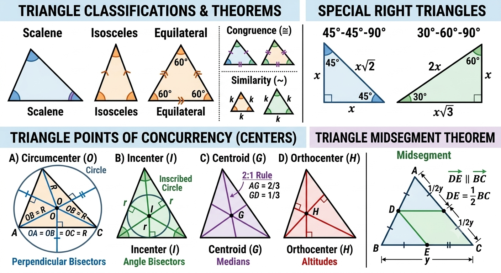

---

# Mathematics Study Notes

---

## 1. Numbers & Radical Expressions

### Irrational & Real Numbers

* **Real Numbers ($\mathbb{R}$):** The set of all rational and irrational numbers, representing every continuous point along the number line.
* **Irrational Numbers:** Numbers that cannot be expressed as a simple fraction $\frac{a}{b}$ (where $a, b \in \mathbb{Z}, b \neq 0$). Their decimal expansions are non-terminating and non-repeating (e.g., $\pi$, $e$, $\sqrt{2}$).

### Radical Expressions

A radical expression takes the general form:


$$\sqrt[n]{x}$$

* **Radicand ($x$):** The value or expression inside the radical sign.
* **Degree/Index ($n$):** The root being taken. If omitted, it defaults to **2** (square root).

#### Odd vs. Even Roots (Real Solutions)

* **Odd Index (e.g., $\sqrt[3]{x}$, $\sqrt[5]{x}$):** Always yields exactly **one real solution**, regardless of whether the radicand is positive or negative.
* *Examples:* $\sqrt[3]{27} = 3$ and $\sqrt[3]{-27} = -3$.


* **Even Index (e.g., $\sqrt{x}$, $\sqrt[4]{x}$):**
* If $x > 0$, it yields **two real roots** (one positive, one negative, denoted as $\pm$).
* If $x < 0$, it yields **zero real solutions** (results in imaginary/complex numbers).
* *Example:* $x^2 = 16 \implies x = \pm 4$.


> 💡 **Tip:** When evaluating the radical *function* $f(x) = \sqrt{x}$, only the principal (positive) root is returned to ensure it passes the vertical line test. However, solving an algebraic equation like $x^2 = c$ requires both $\pm$ roots.

---

## 2. Deriving the Quadratic Formula

To solve the standard quadratic equation $ax^2 + bx + c = 0$ ($a \neq 0$), we isolate $x$ by **completing the square**:

1. **Divide the entire equation by $a$:**

$$x^2 + \frac{b}{a}x + \frac{c}{a} = 0$$


2. **Isolate the variable terms:**

$$x^2 + \frac{b}{a}x = -\frac{c}{a}$$


3. **Add $\left(\frac{b}{2a}\right)^2$ to both sides** to form a perfect square trinomial on the left:

$$x^2 + \frac{b}{a}x + \frac{b^2}{4a^2} = \frac{b^2}{4a^2} - \frac{c}{a}$$


4. **Factor the left side and find a common denominator on the right:**

$$\left(x + \frac{b}{2a}\right)^2 = \frac{b^2 - 4ac}{4a^2}$$


5. **Take the square root of both sides:**

$$x + \frac{b}{2a} = \frac{\pm\sqrt{b^2 - 4ac}}{2a}$$


6. **Subtract $\frac{b}{2a}$ to isolate $x$:**

$$x = \frac{-b \pm \sqrt{b^2 - 4ac}}{2a}$$


---

## 3. Polynomial Theorems & Division

### Synthetic Division

A shorthand computational method used to divide a polynomial by a linear factor of the form $(x - c)$.

* **Example:** Divide $2x^3 - 3x^2 - 5x + 4$ by $x - 3$ ($c = 3$).
* **Execution Layout:**
```text
3 |  2   -3   -5    4
  |       6    9   12
  -------------------
     2    3    4  | 16  <-- Remainder

```


* **Resulting Quotient:** $2x^2 + 3x + 4$ with a remainder of $16$, written as:

$$2x^2 + 3x + 4 + \frac{16}{x - 3}$$


### Rational Root Theorem

If a polynomial $P(x) = a_n x^n + \dots + a_0$ has integer coefficients, every rational root must be of the form $\pm \frac{p}{q}$, where:

* **$p$** = factors of the constant term $a_0$
* **$q$** = factors of the leading coefficient $a_n$

### Step-by-Step Example: Rational Root Theorem

**Problem:** Find all possible rational roots, test them, and completely solve the polynomial equation:


$$P(x) = 2x^3 + x^2 - 7x - 6 = 0$$

#### Step 1: Identify the key components

* **Constant Term ($a_0$):** $-6$
* **Leading Coefficient ($a_n$):** $2$

#### Step 2: List the factors

Find all integer factors ($p$) of the constant term and all integer factors ($q$) of the leading coefficient.

* **Factors of $a_0$ ($p$):** $\pm 1, \pm 2, \pm 3, \pm 6$
* **Factors of $a_n$ ($q$):** $\pm 1, \pm 2$

#### Step 3: Generate the candidate list ($\frac{p}{q}$)

Divide every factor in the $p$ list by every factor in the $q$ list. Eliminate duplicates.


$$\frac{p}{q} = \pm \frac{1}{1}, \pm \frac{1}{2}, \pm \frac{2}{1}, \pm \frac{2}{2}, \pm \frac{3}{1}, \pm \frac{3}{2}, \pm \frac{6}{1}, \pm \frac{6}{2}$$

**Simplified list of candidates:**


$$\pm 1, \pm 2, \pm 3, \pm 6, \pm \frac{1}{2}, \pm \frac{3}{2}$$

---

### Step 4: Test candidates using Synthetic Division

Test the easiest values first (usually $1$ or $-1$). Let's test $x = -1$:

```text
-1 |  2   1   -7   -6
   |     -2    1    6
   ------------------
      2  -1   -6  |  0  <-- Remainder is 0! 

```

Since the remainder is $0$, **$x = -1$ is a confirmed rational root**, and $(x + 1)$ is a factor.

---

### Step 5: Solve the depressed polynomial

The remaining quotient forms a depressed quadratic equation:


$$2x^2 - x - 6 = 0$$

You can solve this remaining quadratic equation by factoring or using the quadratic formula:


$$(2x + 3)(x - 2) = 0$$

Set each factor to zero:

* $2x + 3 = 0 \implies x = -\frac{3}{2}$
* $x - 2 = 0 \implies x = 2$

---

### Final Summary

* **Total Possible Rational Roots generated by the theorem:** $12$ candidates.
* **Actual Roots discovered:** $x = -1$, $x = 2$, and $x = -\frac{3}{2}$.

> 💡 **Tip:** Notice that all three actual roots ($-1, 2, -\frac{3}{2}$) were present in our original list of generated candidates. The theorem successfully narrowed down infinite real numbers to a tiny, testable pool of possibilities.

---

## 4. Coordinate Geometry & Lines

### Linear Equations: Slope-Intercept Form

$$y = mx + c$$

* **Slope ($m$):** Defined as $\frac{\text{Rise}}{\text{Run}} = \frac{y_2 - y_1}{x_2 - x_1}$.
* **$y$-intercept ($c$):** The point where the line crosses the $y$-axis, represented as $(0, c)$.
* **$x$-intercept:** Found by setting $y = 0 \implies x = -\frac{c}{m}$.

### Special Line Slopes

* **Horizontal Lines ($y = c$):** Rise is $0$. Therefore, $\text{Slope } m = \frac{0}{\text{Run}} = 0$.
* **Vertical Lines ($x = k$):** Run is $0$. Therefore, $\text{Slope } m = \frac{\text{Rise}}{0} = \text{Undefined}$ (approaches $\infty$).

### Parallel vs. Perpendicular Lines

* **Parallel Lines:** Slopes are identical ($m_1 = m_2$). The lines run in the same direction and never intersect.
* **Perpendicular Lines:** Slopes are negative reciprocals ($m_1 \cdot m_2 = -1 \implies m_2 = -\frac{1}{m_1}$). The lines intersect at a right angle ($90^\circ$).

---

## 5. Number Classification Hierarchy

```text
                           [ Complex Numbers ]
                                    |
            +-----------------------+-----------------------+
            |                                               |
     [ Real Numbers ]                              [ Imaginary Numbers ]
            |                                          (e.g., 2i, i√3)
    +-------+-------+
    |               |
[ Rational ]   [ Irrational ] (e.g., π, e, √2)
    |
[ Integers ] (..., -2, -1, 0, 1, 2)
    |
[ Fractions/Decimals ] (e.g., 1/2, 0.75)

```

* **Absolute Value ($\vert{}x\vert{}$):** The non-negative distance of a number from zero on a one-dimensional number line.

$$\vert{}x\vert{} = \begin{cases} x & \text{if } x \ge 0 \\ -x & \text{if } x < 0 \end{cases}$$


---

## 6. Geometry Basics & Angle Relationships

### Spatial Dimensions

* **Point (0D):** Indicates a precise location; possesses no width, height, or depth.
* **Line / Ray (1D):** A line extends infinitely in both directions. A ray starts at an endpoint and extends infinitely in one direction.
* **Plane (2D):** A flat, continuous surface stretching infinitely in length and width.
* **Space (3D):** The three-dimensional bounding region containing all volume.


### Core Angle Relationships

* **Adjacent Angles:** Two angles that share a common vertex and side but do not overlap.
* **Vertical Angles:** Opposite angles formed by the intersection of two lines. Vertical angles are always congruent (equal).
* **Complementary Angles:** Two angles whose sum equals exactly **$90^\circ$**.
* **Supplementary Angles:** Two angles whose sum equals exactly **$180^\circ$** (forming a straight line, known as a linear pair).

### Parallel Lines Cut by a Transversal

* **Interior Region:** The structural space bounded between the two parallel lines.
* **Exterior Region:** The space located outside the parallel lines.
* **Alternate Interior Angles:** Equal pairs of angles located on opposite sides of the transversal line, within the interior region.
* **Alternate Exterior Angles:** Equal pairs of angles located on opposite sides of the transversal line, out in the exterior regions.

### Triangles (Classified by Angles)

* **Acute Triangle:** All three internal angles measure less than $90^\circ$.
* **Right Triangle:** Contains exactly one internal angle equal to $90^\circ$.
* **Obtuse Triangle:** Contains exactly one internal angle greater than $90^\circ$.



## 7. Triangle Classifications & Theorems

### Triangle Classifications (By Side/Angle Relationships)

* **Scalene Triangle:** All three sides have different lengths; all three interior angles are distinct.
* **Isosceles Triangle:** At least two sides are equal in length. The angles opposite those equal sides (base angles) are also equal.
* **Equilateral Triangle:** All three sides are equal. All three interior angles are exactly $60^\circ$. It is a regular polygon.

### Congruence vs. Similarity

* **Congruence ($\cong$):** Triangles are identical in both **shape and size**. Corresponding sides are equal, and corresponding angles are equal.
* *Criteria:* SSS (Side-Side-Side), SAS, ASA, AAS, HL (Hypotenuse-Leg for right triangles).


* **Similarity ($\sim$):** Triangles have the **same shape but different sizes**. Corresponding angles are equal, and corresponding sides are **proportional** (scale factor $k$).
* *Criteria:* AA (Angle-Angle), SAS similarity, SSS similarity.


---

## 8. Special Right Triangles

These triangles appear constantly in geometry and trigonometry because their side lengths follow fixed, predictable ratios.

### A. $45^\circ-45^\circ-90^\circ$ Triangle (Isosceles Right Triangle)

* **Side Ratio:** $1 : 1 : \sqrt{2}$
* **Rules:** * If the legs are length $x$, the hypotenuse is $x\sqrt{2}$.
* If the hypotenuse is length $h$, each leg is $\frac{h}{\sqrt{2}} = \frac{h\sqrt{2}}{2}$.


### B. $30^\circ-60^\circ-90^\circ$ Triangle

* **Side Ratio:** $1 : \sqrt{3} : 2$
* **Rules:** * **Short Leg ($x$):** Opposite the $30^\circ$ angle. It is always **half the hypotenuse**.
* **Long Leg ($x\sqrt{3}$):** Opposite the $60^\circ$ angle. It is the short leg multiplied by $\sqrt{3}$.
* **Hypotenuse ($2x$):** Opposite the $90^\circ$ angle. It is twice the short leg.


---

## 9. Triangle Lines & Points of Concurrency

### Perpendicular Bisector $\rightarrow$ Circumcenter ($O$)

* **Line Definition:** A line passing through the midpoint of a triangle's side at a $90^\circ$ angle.
* **Point of Concurrency:** The **Circumcenter**. It is the center of the circle that circumscribes the triangle (passes through all three vertices).
* **Key Property:** The circumcenter is **equidistant from all three vertices** ($OA = OB = OC = R$, where $R$ is the circumradius).
* **Location Based on Triangle Type:**
* **Acute Triangle:** Located strictly **inside** the triangle.
* **Right Triangle:** Located exactly at the **midpoint of the hypotenuse**.
* **Obtuse Triangle:** Located strictly **outside** the triangle.


[Image showing circumcenter location inside an acute triangle, on the hypotenuse of a right triangle, and outside an obtuse triangle]

### Angle Bisector $\rightarrow$ Incenter ($I$)

* **Line Definition:** A line segment that divides an interior angle into two equal halves.
* **Point of Concurrency:** The **Incenter**. It is the center of the **inscribed circle (incircle)** that is tangent to all three sides.
* **Key Property:** The incenter is **equidistant from all three sides** of the triangle. The perpendicular distance from the incenter to any side is the inradius ($r$).
* **Location:** Always located **inside** the triangle, regardless of its shape.

### Median $\rightarrow$ Centroid ($G$)

* **Line Definition:** A line segment connecting a vertex to the midpoint of the opposite side.
* **Point of Concurrency:** The **Centroid**. This point serves as the physical center of gravity (balancing point) of a flat triangle.
* **The 2:1 Centroid Rule:** The centroid divides each median into two segments in a $2:1$ ratio. The segment from the vertex to the centroid is twice as long as the segment from the centroid to the midpoint.
* If a median has length $M$, the distance from vertex to centroid is $\frac{2}{3}M$, and from centroid to side midpoint is $\frac{1}{3}M$.


### Altitude $\rightarrow$ Orthocenter ($H$)

* **Line Definition:** A perpendicular line segment drawn from a vertex to the opposite side (representing the height).
* **Point of Concurrency:** The **Orthocenter**.
* **Location:** Inside an acute triangle, at the right-angle vertex in a right triangle, and outside an conversions obtuse triangle.

---

## 10. Triangle Midsegment Theorem

* **Theorem Definition:** A midsegment is a line segment connecting the midpoints of any two sides of a triangle.
* **Properties:**
1. The midsegment is **parallel** to the third side.
2. The length of the midsegment is exactly **half** the length of the third side.


$$\text{If } D \text{ and } E \text{ are midpoints, then } DE \parallel BC \text{ and } DE = \frac{1}{2}BC$$

