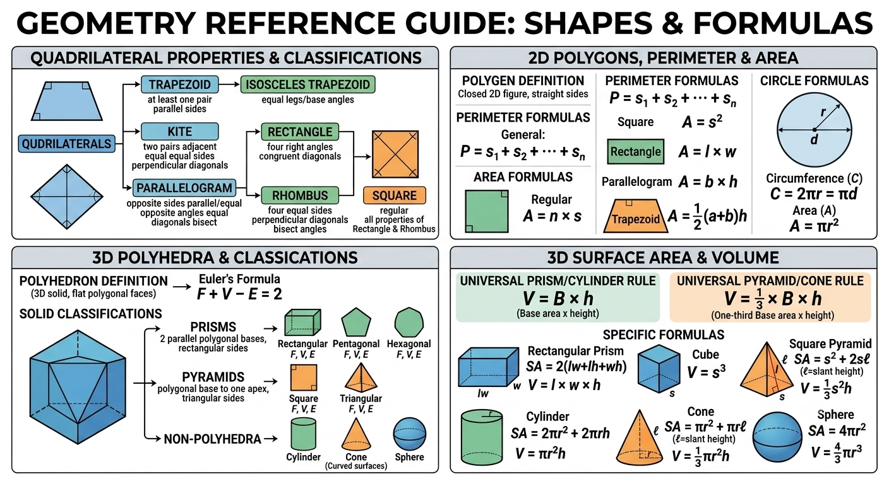

---

# Mathematics Study Notes

---

## 1. Numbers & Radical Expressions

### Irrational & Real Numbers

* **Real Numbers ($\mathbb{R}$):** The set of all rational and irrational numbers, representing every continuous point along the number line.
* **Irrational Numbers:** Numbers that cannot be expressed as a simple fraction $\frac{a}{b}$ (where $a, b \in \mathbb{Z}, b \neq 0$). Their decimal expansions are non-terminating and non-repeating (e.g., $\pi$, $e$, $\sqrt{2}$).

### Radical Expressions

A radical expression takes the general form:


$$\sqrt[n]{x}$$

* **Radicand ($x$):** The value or expression inside the radical sign.
* **Degree/Index ($n$):** The root being taken. If omitted, it defaults to **2** (square root).

#### Odd vs. Even Roots (Real Solutions)

* **Odd Index (e.g., $\sqrt[3]{x}$, $\sqrt[5]{x}$):** Always yields exactly **one real solution**, regardless of whether the radicand is positive or negative.
* *Examples:* $\sqrt[3]{27} = 3$ and $\sqrt[3]{-27} = -3$.


* **Even Index (e.g., $\sqrt{x}$, $\sqrt[4]{x}$):**
* If $x > 0$, it yields **two real roots** (one positive, one negative, denoted as $\pm$).
* If $x < 0$, it yields **zero real solutions** (results in imaginary/complex numbers).
* *Example:* $x^2 = 16 \implies x = \pm 4$.


> 💡 **Tip:** When evaluating the radical *function* $f(x) = \sqrt{x}$, only the principal (positive) root is returned to ensure it passes the vertical line test. However, solving an algebraic equation like $x^2 = c$ requires both $\pm$ roots.

---

## 2. Deriving the Quadratic Formula

To solve the standard quadratic equation $ax^2 + bx + c = 0$ ($a \neq 0$), we isolate $x$ by **completing the square**:

1. **Divide the entire equation by $a$:**

$$x^2 + \frac{b}{a}x + \frac{c}{a} = 0$$


2. **Isolate the variable terms:**

$$x^2 + \frac{b}{a}x = -\frac{c}{a}$$


3. **Add $\left(\frac{b}{2a}\right)^2$ to both sides** to form a perfect square trinomial on the left:

$$x^2 + \frac{b}{a}x + \frac{b^2}{4a^2} = \frac{b^2}{4a^2} - \frac{c}{a}$$


4. **Factor the left side and find a common denominator on the right:**

$$\left(x + \frac{b}{2a}\right)^2 = \frac{b^2 - 4ac}{4a^2}$$


5. **Take the square root of both sides:**

$$x + \frac{b}{2a} = \frac{\pm\sqrt{b^2 - 4ac}}{2a}$$


6. **Subtract $\frac{b}{2a}$ to isolate $x$:**

$$x = \frac{-b \pm \sqrt{b^2 - 4ac}}{2a}$$


---

## 3. Polynomial Theorems & Division

### Synthetic Division

A shorthand computational method used to divide a polynomial by a linear factor of the form $(x - c)$.

* **Example:** Divide $2x^3 - 3x^2 - 5x + 4$ by $x - 3$ ($c = 3$).
* **Execution Layout:**
```text
3 |  2   -3   -5    4
  |       6    9   12
  -------------------
     2    3    4  | 16  <-- Remainder

```


* **Resulting Quotient:** $2x^2 + 3x + 4$ with a remainder of $16$, written as:

$$2x^2 + 3x + 4 + \frac{16}{x - 3}$$


### Rational Root Theorem

If a polynomial $P(x) = a_n x^n + \dots + a_0$ has integer coefficients, every rational root must be of the form $\pm \frac{p}{q}$, where:

* **$p$** = factors of the constant term $a_0$
* **$q$** = factors of the leading coefficient $a_n$

### Step-by-Step Example: Rational Root Theorem

**Problem:** Find all possible rational roots, test them, and completely solve the polynomial equation:


$$P(x) = 2x^3 + x^2 - 7x - 6 = 0$$

#### Step 1: Identify the key components

* **Constant Term ($a_0$):** $-6$
* **Leading Coefficient ($a_n$):** $2$

#### Step 2: List the factors

Find all integer factors ($p$) of the constant term and all integer factors ($q$) of the leading coefficient.

* **Factors of $a_0$ ($p$):** $\pm 1, \pm 2, \pm 3, \pm 6$
* **Factors of $a_n$ ($q$):** $\pm 1, \pm 2$

#### Step 3: Generate the candidate list ($\frac{p}{q}$)

Divide every factor in the $p$ list by every factor in the $q$ list. Eliminate duplicates.


$$\frac{p}{q} = \pm \frac{1}{1}, \pm \frac{1}{2}, \pm \frac{2}{1}, \pm \frac{2}{2}, \pm \frac{3}{1}, \pm \frac{3}{2}, \pm \frac{6}{1}, \pm \frac{6}{2}$$

**Simplified list of candidates:**


$$\pm 1, \pm 2, \pm 3, \pm 6, \pm \frac{1}{2}, \pm \frac{3}{2}$$

---

### Step 4: Test candidates using Synthetic Division

Test the easiest values first (usually $1$ or $-1$). Let's test $x = -1$:

```text
-1 |  2   1   -7   -6
   |     -2    1    6
   ------------------
      2  -1   -6  |  0  <-- Remainder is 0! 

```

Since the remainder is $0$, **$x = -1$ is a confirmed rational root**, and $(x + 1)$ is a factor.

---

### Step 5: Solve the depressed polynomial

The remaining quotient forms a depressed quadratic equation:


$$2x^2 - x - 6 = 0$$

You can solve this remaining quadratic equation by factoring or using the quadratic formula:


$$(2x + 3)(x - 2) = 0$$

Set each factor to zero:

* $2x + 3 = 0 \implies x = -\frac{3}{2}$
* $x - 2 = 0 \implies x = 2$

---

### Final Summary

* **Total Possible Rational Roots generated by the theorem:** $12$ candidates.
* **Actual Roots discovered:** $x = -1$, $x = 2$, and $x = -\frac{3}{2}$.

> 💡 **Tip:** Notice that all three actual roots ($-1, 2, -\frac{3}{2}$) were present in our original list of generated candidates. The theorem successfully narrowed down infinite real numbers to a tiny, testable pool of possibilities.

---

## 4. Coordinate Geometry & Lines

### Linear Equations: Slope-Intercept Form

$$y = mx + c$$

* **Slope ($m$):** Defined as $\frac{\text{Rise}}{\text{Run}} = \frac{y_2 - y_1}{x_2 - x_1}$.
* **$y$-intercept ($c$):** The point where the line crosses the $y$-axis, represented as $(0, c)$.
* **$x$-intercept:** Found by setting $y = 0 \implies x = -\frac{c}{m}$.

### Special Line Slopes

* **Horizontal Lines ($y = c$):** Rise is $0$. Therefore, $\text{Slope } m = \frac{0}{\text{Run}} = 0$.
* **Vertical Lines ($x = k$):** Run is $0$. Therefore, $\text{Slope } m = \frac{\text{Rise}}{0} = \text{Undefined}$ (approaches $\infty$).

### Parallel vs. Perpendicular Lines

* **Parallel Lines:** Slopes are identical ($m_1 = m_2$). The lines run in the same direction and never intersect.
* **Perpendicular Lines:** Slopes are negative reciprocals ($m_1 \cdot m_2 = -1 \implies m_2 = -\frac{1}{m_1}$). The lines intersect at a right angle ($90^\circ$).

---

## 5. Number Classification Hierarchy

```text
                           [ Complex Numbers ]
                                    |
            +-----------------------+-----------------------+
            |                                               |
     [ Real Numbers ]                              [ Imaginary Numbers ]
            |                                          (e.g., 2i, i√3)
    +-------+-------+
    |               |
[ Rational ]   [ Irrational ] (e.g., π, e, √2)
    |
[ Integers ] (..., -2, -1, 0, 1, 2)
    |
[ Fractions/Decimals ] (e.g., 1/2, 0.75)

```

* **Absolute Value ($\vert{}x\vert{}$):** The non-negative distance of a number from zero on a one-dimensional number line.

$$\vert{}x\vert{} = \begin{cases} x & \text{if } x \ge 0 \\ -x & \text{if } x < 0 \end{cases}$$


---

## 6. Geometry Basics & Angle Relationships

### Spatial Dimensions

* **Point (0D):** Indicates a precise location; possesses no width, height, or depth.
* **Line / Ray (1D):** A line extends infinitely in both directions. A ray starts at an endpoint and extends infinitely in one direction.
* **Plane (2D):** A flat, continuous surface stretching infinitely in length and width.
* **Space (3D):** The three-dimensional bounding region containing all volume.


### Core Angle Relationships

* **Adjacent Angles:** Two angles that share a common vertex and side but do not overlap.
* **Vertical Angles:** Opposite angles formed by the intersection of two lines. Vertical angles are always congruent (equal).
* **Complementary Angles:** Two angles whose sum equals exactly **$90^\circ$**.
* **Supplementary Angles:** Two angles whose sum equals exactly **$180^\circ$** (forming a straight line, known as a linear pair).

### Parallel Lines Cut by a Transversal

* **Interior Region:** The structural space bounded between the two parallel lines.
* **Exterior Region:** The space located outside the parallel lines.
* **Alternate Interior Angles:** Equal pairs of angles located on opposite sides of the transversal line, within the interior region.
* **Alternate Exterior Angles:** Equal pairs of angles located on opposite sides of the transversal line, out in the exterior regions.

### Triangles (Classified by Angles)

* **Acute Triangle:** All three internal angles measure less than $90^\circ$.
* **Right Triangle:** Contains exactly one internal angle equal to $90^\circ$.
* **Obtuse Triangle:** Contains exactly one internal angle greater than $90^\circ$.

## 7. Triangle Classifications & Theorems

### Triangle Classifications (By Side/Angle Relationships)

* **Scalene Triangle:** All three sides have different lengths; all three interior angles are distinct.
* **Isosceles Triangle:** At least two sides are equal in length. The angles opposite those equal sides (base angles) are also equal.
* **Equilateral Triangle:** All three sides are equal. All three interior angles are exactly $60^\circ$. It is a regular polygon.

### Congruence vs. Similarity

* **Congruence ($\cong$):** Triangles are identical in both **shape and size**. Corresponding sides are equal, and corresponding angles are equal.
* *Criteria:* SSS (Side-Side-Side), SAS, ASA, AAS, HL (Hypotenuse-Leg for right triangles).


* **Similarity ($\sim$):** Triangles have the **same shape but different sizes**. Corresponding angles are equal, and corresponding sides are **proportional** (scale factor $k$).
* *Criteria:* AA (Angle-Angle), SAS similarity, SSS similarity.


---

## 8. Special Right Triangles

These triangles appear constantly in geometry and trigonometry because their side lengths follow fixed, predictable ratios.

### A. $45^\circ-45^\circ-90^\circ$ Triangle (Isosceles Right Triangle)

* **Side Ratio:** $1 : 1 : \sqrt{2}$
* **Rules:** * If the legs are length $x$, the hypotenuse is $x\sqrt{2}$.
* If the hypotenuse is length $h$, each leg is $\frac{h}{\sqrt{2}} = \frac{h\sqrt{2}}{2}$.


### B. $30^\circ-60^\circ-90^\circ$ Triangle

* **Side Ratio:** $1 : \sqrt{3} : 2$
* **Rules:** * **Short Leg ($x$):** Opposite the $30^\circ$ angle. It is always **half the hypotenuse**.
* **Long Leg ($x\sqrt{3}$):** Opposite the $60^\circ$ angle. It is the short leg multiplied by $\sqrt{3}$.
* **Hypotenuse ($2x$):** Opposite the $90^\circ$ angle. It is twice the short leg.


## 9. Triangle Lines & Points of Concurrency

### Perpendicular Bisector $\rightarrow$ Circumcenter ($O$)

* **Line Definition:** A line passing through the midpoint of a triangle's side at a $90^\circ$ angle.
* **Point of Concurrency:** The **Circumcenter**. It is the center of the circle that circumscribes the triangle (passes through all three vertices).
* **Key Property:** The circumcenter is **equidistant from all three vertices** ($OA = OB = OC = R$, where $R$ is the circumradius).
* **Location Based on Triangle Type:**
* **Acute Triangle:** Located strictly **inside** the triangle.
* **Right Triangle:** Located exactly at the **midpoint of the hypotenuse**.
* **Obtuse Triangle:** Located strictly **outside** the triangle.


[Image showing circumcenter location inside an acute triangle, on the hypotenuse of a right triangle, and outside an obtuse triangle]

### Angle Bisector $\rightarrow$ Incenter ($I$)

* **Line Definition:** A line segment that divides an interior angle into two equal halves.
* **Point of Concurrency:** The **Incenter**. It is the center of the **inscribed circle (incircle)** that is tangent to all three sides.
* **Key Property:** The incenter is **equidistant from all three sides** of the triangle. The perpendicular distance from the incenter to any side is the inradius ($r$).
* **Location:** Always located **inside** the triangle, regardless of its shape.

### Median $\rightarrow$ Centroid ($G$)

* **Line Definition:** A line segment connecting a vertex to the midpoint of the opposite side.
* **Point of Concurrency:** The **Centroid**. This point serves as the physical center of gravity (balancing point) of a flat triangle.
* **The 2:1 Centroid Rule:** The centroid divides each median into two segments in a $2:1$ ratio. The segment from the vertex to the centroid is twice as long as the segment from the centroid to the midpoint.
* If a median has length $M$, the distance from vertex to centroid is $\frac{2}{3}M$, and from centroid to side midpoint is $\frac{1}{3}M$.


### Altitude $\rightarrow$ Orthocenter ($H$)

* **Line Definition:** A perpendicular line segment drawn from a vertex to the opposite side (representing the height).
* **Point of Concurrency:** The **Orthocenter**.
* **Location:** Inside an acute triangle, at the right-angle vertex in a right triangle, and outside an conversions obtuse triangle.

---

## 10. Triangle Midsegment Theorem

* **Theorem Definition:** A midsegment is a line segment connecting the midpoints of any two sides of a triangle.
* **Properties:**
1. The midsegment is **parallel** to the third side.
2. The length of the midsegment is exactly **half** the length of the third side.


$$\text{If } D \text{ and } E \text{ are midpoints, then } DE \parallel BC \text{ and } DE = \frac{1}{2}BC$$


## 11. Quadrilaterals & Polygons

### Types of Quadrilaterals & Properties

* **Trapezoid:** A quadrilateral with at least one pair of parallel sides (called bases).
* *Isosceles Trapezoid:* Non-parallel sides (legs) are equal; base angles are equal.


* **Kite:** A quadrilateral with two distinct pairs of adjacent, equal sides.
* Diagonals intersect at a perfect $90^\circ$ angle; the main diagonal bisects the other.


* **Parallelogram:** Both pairs of opposite sides are parallel and equal in length.
* Opposite angles are equal; consecutive angles are supplementary ($180^\circ$). Diagonals bisect each other.


* **Rectangle:** A specialized parallelogram with four $90^\circ$ right angles.
* Diagonals are congruent (equal in length).


* **Square:** A regular quadrilateral. It is simultaneously a rectangle and a rhombus.
* Four equal sides and four $90^\circ$ right angles. Diagonals are equal, perpendicular, and bisect each other.


### Polygons & Perimeter

* **Polygon:** A closed 2D plane figure bounded by three or more straight line segments.
* **Perimeter Formulas:**
* **General Polygon:** Sum of all outer side lengths ($P = s_1 + s_2 + \dots + s_n$).
* **Regular Polygon:** $P = n \times s$ (where $n$ is the number of sides, and $s$ is the side length).




## 12. 2D Area & Circle Formulas

### 2D Area Formulas

* **Square:** $A = s^2$ *(where $s$ = side length)*
* **Rectangle:** $A = l \times w$ *(where $l$ = length, $w$ = width)*
* **Parallelogram:** $A = b \times h$ *(where $b$ = base, $h$ = perpendicular height)*
* **Trapezoid:** $A = \frac{1}{2}(a + b)h$ *(where $a, b$ = parallel bases, $h$ = height)*

### Circle Formulas

* **Circumference ($C$):** The perimeter of a circle.

$$C = 2\pi r = \pi d$$


* **Area ($A$):** The total space enclosed inside the boundary.

$$A = \pi r^2$$


*(where $r$ = radius, $d$ = diameter $= 2r$)*

---

## 13. 3D Polyhedra & Solids

### Definitions

* **Polyhedron (plural: Polyhedra):** A 3D solid bounded by flat polygonal faces.
* **Faces:** The flat polygon surfaces.
* **Edges:** The line segments where two faces meet.
* **Vertices:** The corner points where three or more edges intersect.


* **Euler's Formula:** For any convex polyhedron:

$$F + V - E = 2$$


*(where $F$ = Faces, $V$ = Vertices, $E$ = Edges)*

### Solid Classifications

* **Prism:** A polyhedron with two identical, parallel polygonal bases. Sides are rectangles.
* *Rectangular Prism:* Bases are rectangles (6 faces, 8 vertices, 12 edges).
* *Pentagonal Prism:* Bases are pentagons (7 faces, 10 vertices, 15 edges).
* *Hexagonal Prism:* Bases are hexagons (8 faces, 12 vertices, 18 edges).


* **Pyramid:** A polyhedron formed by connecting a polygonal base to a single top point (apex). Sides are triangles.
* *Square Pyramid:* Base is a square (5 faces, 5 vertices, 8 edges).
* *Triangular Pyramid (Tetrahedron):* Base is a triangle (4 faces, 4 vertices, 6 edges).


* **Non-Polyhedra (Curved Solids):**
* **Cylinder:** Features two parallel circular bases connected by a smooth, curved surface.
* **Cone:** Features a circular base tapering smoothly to an apex point. *Not a polyhedron because it has a curved surface.*
* **Sphere:** A perfectly round 3D surface where all points are equidistant from the center.


---

## 14. Surface Area (SA) Formulas

Total Surface Area accounts for the sum of all flat faces and curved exterior regions.

* **Rectangular Prism:** $SA = 2(lw + lh + wh)$
* **Square Pyramid:** $SA = \text{Base Area} + \text{Lateral Area} = s^2 + 2s\ell$
*(where $s$ = base side length, $\ell$ = slant height of the triangular face)*
* **Cylinder:** $SA = 2\pi r^2 + 2\pi rh$
*(where $2\pi r^2$ represents the two circular bases; $2\pi rh$ represents the unrolled rectangular lateral side)*
* **Cone:** $SA = \pi r^2 + \pi r\ell$
*(where $\ell$ = slant height $= \sqrt{r^2 + h^2}$)*
* **Sphere:** $SA = 4\pi r^2$

---

## 15. Volume (V) Formulas

> 💡 **Universal Prism/Cylinder Rule:** The volume for **any** uniform prism or cylinder is always the **Area of the Base ($B$) multiplied by the perpendicular height ($h$)**:
> $$V = B \times h$$
> 
> 

* **Rectangular Prism:** $V = l \times w \times h$  *(Base area $B = lw$)*
* **Cube:** $V = s^3$
* **Cylinder:** $V = \pi r^2 h$ *(Base area $B = \pi r^2$)*

> 💡 **Universal Pyramid/Cone Rule:** The volume of a pyramid or cone is exactly **$\frac{1}{3}$** of the volume of its corresponding prism/cylinder with the same base and height:
> $$V = \frac{1}{3} \times B \times h$$
> 
> 

* **Pyramid:** $V = \frac{1}{3} \times \text{Base Area} \times h$
* **Cone:** $V = \frac{1}{3}\pi r^2 h$
* **Sphere:** $V = \frac{4}{3}\pi r^3$

---

## 16. Functions: Foundations & Graphical Tests

### Definitions & Core Properties

A **function** is a relation where each input element ($x$) from the **domain** maps to exactly one output element ($y$) in the **codomain**.

* **Domain:** The set of all valid, real inputs ($x$) for which the function is defined.
* **Range:** The set of all actual outputs ($y$) produced by the function.
* **Zeros (Roots/Intercepts):** The input values where $f(x) = 0$. Graphically, these are the $x$-intercepts.

### The Graphical Tests

* **Horizontal Line Test (HLT):** If *any* horizontal line passes through a function's graph more than once, the function is **not** one-to-one (injective) and lacks a true inverse function.
* **Vertical Line Test (VLT):** If *any* vertical line passes through a graph more than once, the relation is **not** a function.

---

## 17. Asymptotes & Domain Behavior

### Asymptotes

An **asymptote** is a line that the graph approaches arbitrarily closely but generally does not cross as the variables head toward extreme boundaries.

* **Vertical Asymptote (VA):** Occurs where the denominator equals zero (and cannot be cancelled out). $x \to c, \, f(x) \to \pm\infty$.
* **Horizontal Asymptote (HA):** Dictates end behavior as $x \to \pm\infty$.

### Algebraic Domain Manipulation Rule

> ⚠️ **The Domain Continuity Rule:** When adding, subtracting, or multiplying functions algebraically, the new domain is the **intersection** of the individual domains. **Except during division**, where you must explicitly exclude any input values that make the divisor function equal to zero.

* **Example:** Let $f(x) = \sqrt{x}$ (Domain: $[0, \infty)$) and $g(x) = x - 3$ (Domain: $(-\infty, \infty)$).
* The domain of $f(x) \cdot g(x)$ remains $[0, \infty)$.
* The domain of $\frac{f(x)}{g(x)} = \frac{\sqrt{x}}{x - 3}$ narrows to $[0, 3) \cup (3, \infty)$ because $x = 3$ yields division by zero.


### Composite Functions

A composite function passes an input through one function, then passes that output directly into a second function: $(f \circ g)(x) = f(g(x))$.

* **Composite Domain Requirement:** The input $x$ must lie within the domain of $g(x)$, and the resulting value $g(x)$ must fit within the domain of $f(x)$.

---

## 18. Parent Functions & Power Behaviors

### Core Parent Shapes

| Function | Type | Domain | Range | Asymptotes / Key Features |
| --- | --- | --- | --- | --- |
| $f(x) = x^2$ | Even Power | $(-\infty, \infty)$ | $[0, \infty)$ | Vertex at $(0,0)$; symmetric over $y$-axis. |
| $f(x) = x^4$ | Even Power | $(-\infty, \infty)$ | $[0, \infty)$ | Flatter base near zero, steeper walls than $x^2$. |
| $f(x) = \frac{1}{x}$ | Rational | $x \neq 0$ | $y \neq 0$ | VA: $x = 0$, HA: $y = 0$. Hyperbola shape. |

### Power Functions Rule ($x^n$)

For single-term polynomials $f(x) = x^n$:

* **If $n$ is Even ($x^2, x^4, x^6$):** The graph resembles a **U-shaped parabola**. Both ends shoot in the same vertical direction ($\infty$).
* *Range:* Bound on one side (e.g., $[0, \infty)$ if the leading coefficient is positive).


* **If $n$ is Odd ($x^3, x^5, x^7$):** The graph resembles an **S-shaped curve**. The ends shoot in opposite directions.
* *Range:* Fully unbounded, $(-\infty, \infty)$.


---

## 19. Extrema & Continuity

### Relative Maxima and Minima (Hills and Valleys)

* **Relative Maxima (Hills):** A point $(c, f(c))$ where $f(c) \ge f(x)$ for all nearby values of $x$. The function shifts from increasing to decreasing.
* **Relative Minima (Valleys):** A point $(c, f(c))$ where $f(c) \le f(x)$ for all nearby values of $x$. The function shifts from decreasing to increasing.

### Discontinuous Functions

A function is discontinuous if its graph has gaps, breaks, or jumps. The three primary types are:

1. **Removable (Hole):** The graph has a single missing point where a common factor cancels out algebraically.
2. **Infinite (Asymptote):** The graph breaks and races toward $\pm\infty$ along a vertical line.
3. **Jump:** The graph breaks cleanly and resumes at a completely different $y$-value (common in piecewise functions).

---

## 20. Comprehensive Graph Transformations

Any modified parent function can be structurally analyzed using the standard transformation template:


$$f(x) = a \cdot g\big(b(x - h)\big) + k$$

### Transformation Operational Grid

| Term | Parameter Scope | Graphical Transformation Effect |
| --- | --- | --- |
| **$a$** | $a > 1$ | Vertical stretch (stretches graph away from $x$-axis). |
|  | $0 < a < 1$ | Vertical compression/shrink (flattens graph toward $x$-axis). |
|  | $a < 0$ (Negative) | **Reflection across the $x$-axis** (flips upside down). |
| **$b$** | $b > 1$ | Horizontal compression/shrink (squeezes graph inward toward $y$-axis). |
|  | $0 < b < 1$ | Horizontal stretch (pulls graph outward away from $y$-axis). |
|  | $b < 0$ (Negative) | **Reflection across the $y$-axis** (flips left-to-right). |
| **$h$** | $h > 0$ *(e.g., $x - 3$)* | **Horizontal shift right** by $h$ units. |
|  | $h < 0$ *(e.g., $x + 3$)* | **Horizontal shift left** by $\vert h \vert$ units. |
| **$k$** | $k > 0$ | **Vertical shift up** by $k$ units. |
|  | $k < 0$ | **Vertical shift down** by $\vert k \vert$ units. |

---
