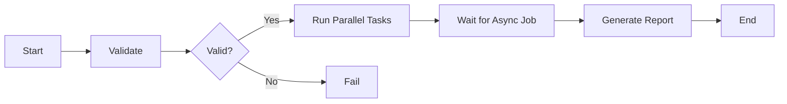

# AWS Step Functions Revision Notes

This repository contains two practical Step Functions examples:

- [LambdaGlueAthenaS3](LambdaGlueAthenaS3) — an end-to-end data pipeline using Lambda, Glue, Athena, and S3.
- [StepFunctionForRevision](StepFunctionForRevision) — a smaller, revision-friendly example with many Step Functions patterns.

The goal of this note is to give you a quick, crisp summary of the most important Step Functions concepts.

---

## 1. What is AWS Step Functions?

AWS Step Functions is a serverless workflow orchestrator. It lets you coordinate multiple services such as Lambda, Glue, Athena, SNS, SQS, and API Gateway in a visual, state-based workflow.

Think of it as:

- a workflow engine for business processes
- a way to chain tasks together
- a tool for handling retries, branching, and failures cleanly

---

## 2. Core building blocks

### Task state

Used to call a service or function.

Example:

- invoke a Lambda function
- start a Glue job
- submit an Athena query

### Choice state

Used for branching logic.

Example:

- if validation passes, continue
- if validation fails, go to an error path

### Parallel state

Used when multiple independent tasks can run at the same time.

Example:

- validate file
- scan for virus
- check schema
- detect duplicates

### Map state

Used to process a list of items one by one.

Example:

- process each record in an array
- run the same workflow for many records

### Wait state

Used to pause execution for a duration or until a specific time.

Example:

- wait before checking Athena query status
- poll for job completion

### Pass state

Used to pass input through or transform it without calling a service.

### Succeed / Fail states

Used as terminal states.

### Retry and Catch

Used for resilience.

Example:

- retry a Lambda call 3 times
- if it still fails, route to a failure handler

---

## 3. Important Step Functions concepts

### State machine

A state machine is the workflow definition written in Amazon States Language (ASL).

### Execution

An execution is one run of the state machine.

### Input and output

Each state receives input and can produce output. You can shape this using:

- InputPath
- OutputPath
- Parameters
- ResultPath
- ResultSelector

### Error handling

Use:

- Retry
- Catch
- Fail

### Branching

Use:

- Choice
- Next
- Default

---

## 4. Common patterns you should remember

### A. Sequential flow

A → B → C → D

Good for linear workflows such as:

- validate input
- archive file
- run ETL
- generate report

### B. Branching flow

A decision point sends execution to different paths.

Good for:

- success vs failure
- approved vs rejected

### C. Parallel flow

Multiple tasks run at the same time.

Good for:

- independent validations
- fan-out processing

### D. Polling loop

A task starts an asynchronous job, then Wait + Task checks status repeatedly.

Good for:

- Glue jobs
- Athena queries
- long-running services

### E. Map loop

The same workflow is repeated over each element in an array.

Good for:

- batch records
- multiple files
- repeated transformations

---

## 5. How the examples in this repo map to these concepts

### In [LambdaGlueAthenaS3](LambdaGlueAthenaS3)

This example shows a realistic production-style workflow:

1. Validate input file
2. Run parallel checks
3. Archive the original file
4. Start Glue ETL
5. Wait for Glue completion
6. Run Athena query
7. Generate outputs and reports
8. Handle failures with retries and catches

This is a great example of:

- Task states
- Parallel states
- Wait states
- Choice states
- Retry / Catch
- long-running orchestration

### In [StepFunctionForRevision](StepFunctionForRevision)

This example is more focused on learning the syntax and state patterns.

It helps you revise:

- Task
- Choice
- Parallel
- Map
- Wait
- Retry
- Catch
- Pass
- Succeed / Fail

---

## 6. Quick cheat sheet

```json
{
  "StartAt": "Validate",
  "States": {
    "Validate": {
      "Type": "Task",
      "Resource": "arn:aws:lambda:region:account:function:validate",
      "Next": "CheckResult"
    },
    "CheckResult": {
      "Type": "Choice",
      "Choices": [
        {
          "Variable": "$.status",
          "StringEquals": "SUCCESS",
          "Next": "Process"
        }
      ],
      "Default": "Fail"
    },
    "Process": {
      "Type": "Parallel",
      "Branches": [
        { "StartAt": "A", "States": { "A": { "Type": "Task", "End": true } } },
        { "StartAt": "B", "States": { "B": { "Type": "Task", "End": true } } }
      ],
      "End": true
    },
    "Fail": {
      "Type": "Fail",
      "Error": "ValidationFailed",
      "Cause": "Input was invalid"
    }
  }
}
```

---

## 7. One-line memory trick

Remember this order for quick revision:

- Start → Task → Choice → Parallel/Map → Wait → Retry/Catch → End

---

## 8. Simple workflow diagram



---

## 9. Fast revision checklist

Before an interview or exam, make sure you can explain:

- what a state machine is
- the difference between Task, Choice, Parallel, and Map
- when to use Wait
- how Retry and Catch work
- how to use ResultPath and Parameters
- how Step Functions coordinate Lambda, Glue, and Athena

If you want, this README can later be expanded into a more detailed interview-style guide with AWS-specific examples and diagrams.
