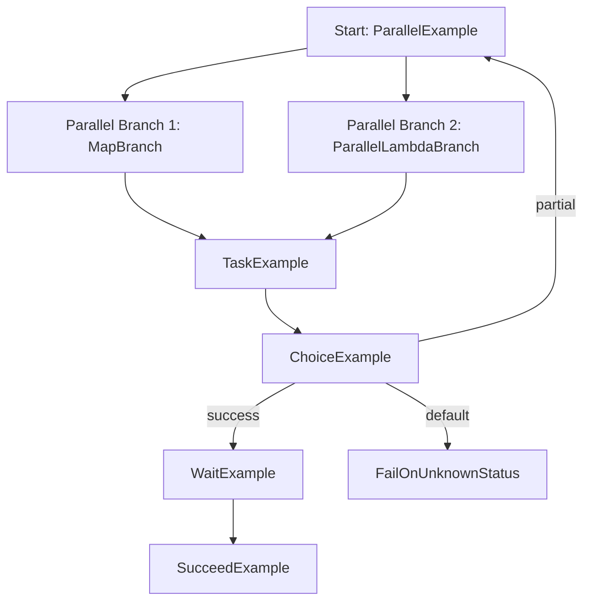

# AWS Step Functions — Revision Example

This repository contains a heavily commented AWS Step Functions state machine example and a minimal Lambda handler to demonstrate common Step Functions features in a compact, revision-friendly way.

The sample is designed to help you quickly understand how to build workflows that combine:

- parallel execution
- map iteration over arrays
- branching logic
- wait-and-poll patterns
- task callbacks
- retries and catches
- input and output transformation

## Files in this repository

- [state_machine.asl.yaml](state_machine.asl.yaml) — the Step Functions definition in YAML with detailed comments
- [handler.py](handler.py) — a simple Python Lambda handler used by the Task examples

## What this implementation demonstrates

This example is intentionally broad. It shows how Step Functions can orchestrate multiple patterns in one workflow:

- Parallel state to run independent branches concurrently
- Map state to process each item in an array
- Task state to invoke Lambda functions
- Choice state to route execution based on data
- Wait state to pause before retrying or continuing
- Succeed and Fail states for graceful termination
- Retry and Catch for error handling
- Parameters, ResultPath, ResultSelector, and Input/Output manipulation for data flow
- callback token usage with `invoke.waitForTaskToken`

## High-level workflow

The state machine begins with a Parallel state and then moves through a Task example, Choice logic, a Wait state, and terminal states. The workflow is organized so you can study each Step Functions concept independently while also seeing how they work together in a realistic orchestration.

## State-by-state walkthrough

### 1. ParallelExample

This is the first state and it introduces the Parallel state.

It contains two branches:

1. MapBranch
   - Uses Map to iterate over an array from the input.
   - For each item, a Task state calls a Lambda.
   - The current item is passed into the Lambda using `Payload.item.$: "$"`.
   - `ResultPath: $.lambdaResult` stores the Lambda result under the `lambdaResult` field.
   - `Retry` and `Catch` are used to demonstrate resilience.
   - If an item fails, the Catch routes to `HandleMapItemError`, which uses a Pass state to continue gracefully.

2. ParallelLambdaBranch
   - Uses a Lambda task with `invoke.waitForTaskToken`.
   - This demonstrates the callback pattern where the Lambda starts work and pauses until a task token is returned.
   - `ResultSelector` transforms the response shape before it is saved with `ResultPath`.
   - `HeartbeatSeconds` and `TimeoutSeconds` show how long-running callback tasks can be controlled.
   - `Retry` and `Catch` provide failure handling.

### 2. TaskExample

This state demonstrates a standard Task invocation of a Lambda function.

It shows several important patterns:

- `Parameters` are used to build the payload sent to Lambda
- `ResultSelector` reshapes the Lambda output before it is stored
- `ResultPath` places the processed result under `$.taskResult`
- `TimeoutSeconds` and `HeartbeatSeconds` control execution limits
- `Retry` handles transient failures
- `Catch` routes errors to an error-handling path

### 3. HandleTaskError

This Pass state is used as an error normalization step. It converts an error path into a simple, structured object before continuing.

### 4. ChoiceExample

This state demonstrates branching logic.

The workflow checks the value of `$.taskResult.status` and routes execution to:

- `WaitExample` when the status is `success`
- `ParallelExample` when the status is `partial`
- `FailOnUnknownStatus` for any other value

### 5. WaitExample

This Wait state pauses execution for a fixed number of seconds before moving to the next step.

It is useful when the workflow needs to wait for another service or resource to become available.

### 6. SucceedExample

This terminal state indicates successful completion.

### 7. FailOnUnknownStatus

This Fail state stops the execution with a custom error when the workflow receives an unexpected status.

### 8. IntrinsicDemo

This Pass state is a simple example of using Step Functions intrinsic functions and data shaping. It shows that even lightweight states can be used to transform and store data.

## Key Step Functions features used

### Task state

Used to invoke Lambda functions and other services.

### Parallel state

Used to run independent branches concurrently.

### Map state

Used to repeat the same logic for each item in an array.

### Choice state

Used to route execution based on conditions.

### Wait state

Used to pause execution before continuing.

### Retry and Catch

Used to make the workflow more resilient.

### ResultPath, ResultSelector, and Parameters

Used to control how input and output are passed through the workflow.

### Callback token pattern

Used with `invoke.waitForTaskToken` to pause a workflow until another component completes and sends the token back.

## Input and output handling

A very important concept in Step Functions is how input is passed from one state to another.

This example illustrates that clearly:

- `Parameters` creates a new payload for the next service call
- `ResultPath` places the output of a state into the existing execution context
- `ResultSelector` reshapes the output before it is stored
- `Input` and `Output` data can be routed without needing custom code in every step

This makes the state machine more declarative and easier to maintain.

## Workflow diagram



## Before you begin

- Install and configure the AWS CLI.
- Ensure you have permissions to create Lambda functions and Step Functions state machines.
- Replace all placeholder ARNs in [state_machine.asl.yaml](state_machine.asl.yaml) with real values from your AWS account.

## Quick deployment steps

1. Convert the YAML file to JSON because Step Functions APIs expect JSON:

```bash
python - <<'PY'
import yaml, json
with open('state_machine.asl.yaml') as f:
    obj = yaml.safe_load(f)
print(json.dumps(obj, indent=2))
PY
```

Save the output to `state_machine.asl.json`.

2. Create an IAM role for Step Functions:

```bash
aws iam create-role --role-name StepFunctionsStateMachineRole \
  --assume-role-policy-document file://trust-policy.json
```

3. Create or deploy the Lambda function(s). A simple example:

```bash
zip function.zip handler.py
aws lambda create-function --function-name WorkerFunction \
  --runtime python3.9 --handler handler.handler --zip-file fileb://function.zip \
  --role arn:aws:iam::<ACCOUNT_ID>:role/YourLambdaExecutionRole
```

4. Create the state machine:

```bash
aws stepfunctions create-state-machine \
  --name VerboseExampleStateMachine \
  --definition file://state_machine.asl.json \
  --role-arn arn:aws:iam::<ACCOUNT_ID>:role/StepFunctionsStateMachineRole
```

## Testing the state machine

Use `start-execution` with input that includes an `items` array for the Map state:

```bash
aws stepfunctions start-execution \
  --state-machine-arn arn:aws:states:us-east-1:<ACCOUNT_ID>:stateMachine:VerboseExampleStateMachine \
  --input '{"items": [{"id":1},{"id":2}], "other": "value"}'
```

## Notes and next steps

- The ASL file contains placeholders and comments for learning purposes.
- Replace the Lambda ARNs and role ARN with values from your own account.
- For production usage, consider AWS SAM, CloudFormation, or the Serverless Framework.

## Quick revision checklist

If you are revising for interviews or exams, make sure you can explain:

- the difference between Task, Parallel, Map, and Choice states
- how Retry and Catch work
- how ResultPath and ResultSelector change the data flow
- how callback token patterns work
- why Wait states are useful for asynchronous services
- how a state machine terminates successfully or with an error
